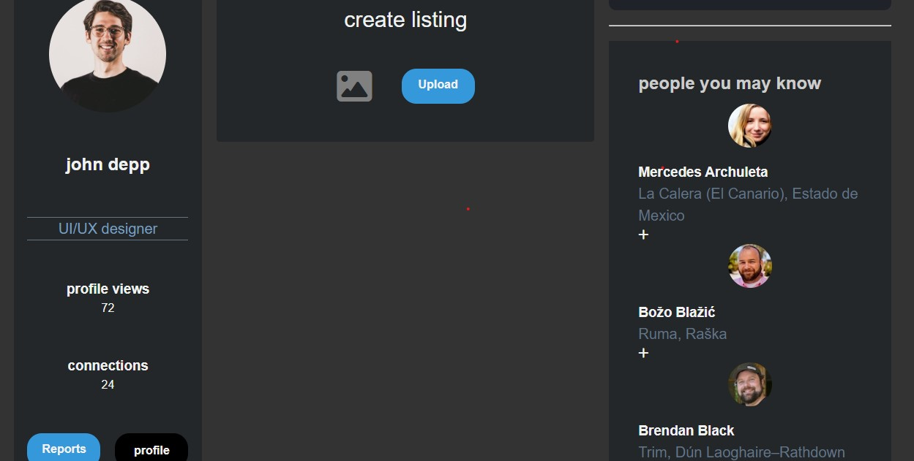

# Fake Job Website

A modern, dark-themed platform designed to connect workers and employers. The website enables job seekers and employers to connect and find the right opportunities. With a focus on user experience by the best form of simplicity, this platform makes job searching and recruitment easier and more efficient.

## Features

- **Dark Theme:** Sleek, modern design with a focus on dark mode for a comfortable user experience.

- **User Profiles:** Both job seekers and employers can create profiles to make the hiring process smooth.
- **Search Functionality:** Job seekers can filter and search for jobs based on categories, location, and more.

## Technologies Used

- **HTML5:** For creating the structure of the web pages.
- **CSS3:** For styling, including a custom dark theme.
- **JavaScript:** For interactivity, such as form validation and dynamic content updates.
- **Font Awesome:** For icons, including social media icons and navigation elements.
